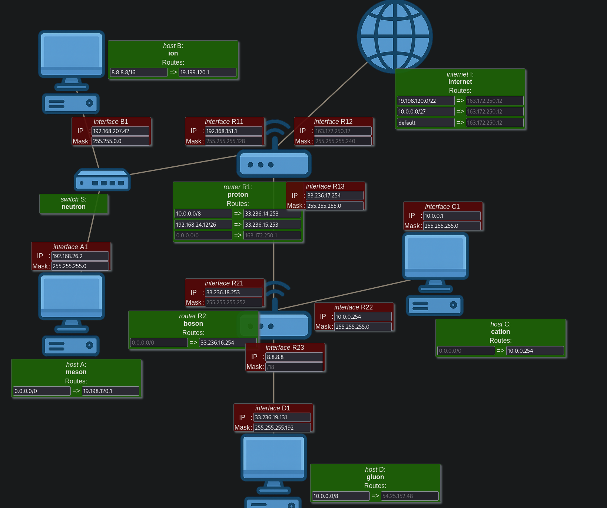
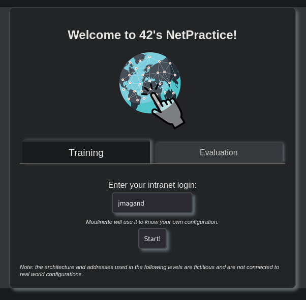
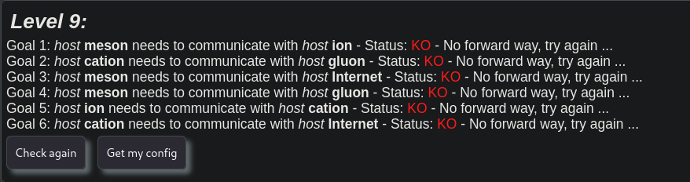
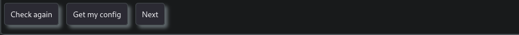
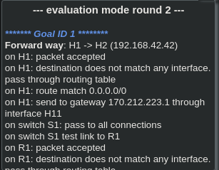
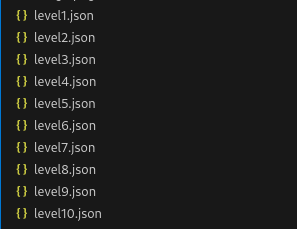
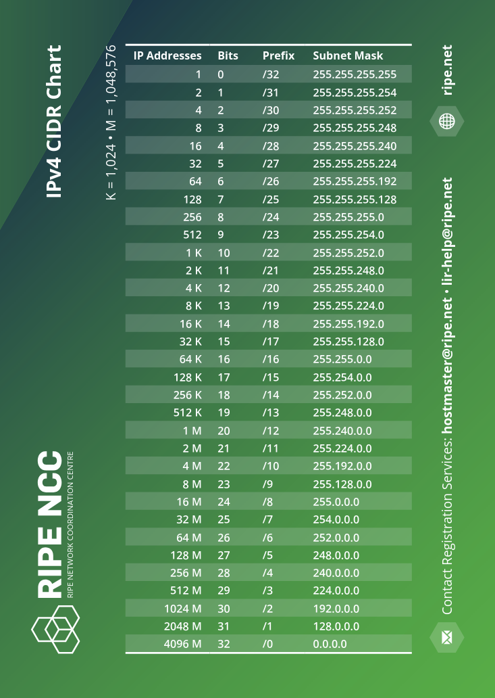
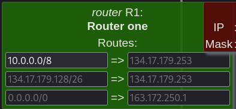
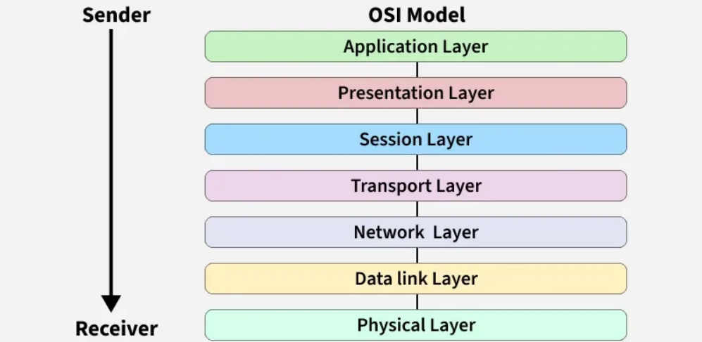

<em>This project has been created as part of the 42 curriculum by jmagand</em>

<h1> <strong>✨ NetPractice ✨</strong></h1>

### 🎯 **Project Overview**

This project is a **network configuration simulator** where you solve networking problems to make virtual networks function properly.   With **10 progressive levels**, you'll diagnose and fix misconfigured networks through a practical web interface.

## 📋 Table of Contents
- [🔍 Description](#-description)
- [📖 Instructions](#-instructions)
  - [🚀 Installation](#-installation)
  - [⚙️ How It Works](#️-how-it-works)
  - [📤 Submission Details](#-submission-details)
- [📚 Resources](#-resources)
  - [📘 IP Addressing & Subnetting](#-ip-addressing--subnetting)
  - [🔗 TCP/IP Protocols](#-tcpip-protocols)
  - [🖧 Default Gateways, Routers & Switches](#-default-gateways-routers--switches)
  - [📡 OSI Model Layers](#-osi-model-layers)
  - [🔗 Links to documentation](#-links-to-documentation)
  - [🤖 About AI](#-about-ai)

---

<strong>🔍 Description</strong>

This project involves solving networking problems to make a network function properly.

**Key Features:**

- **10 training levels** of increasing complexity
- **Visual network diagrams** with interactive configuration
- **Real-time feedback** through system logs
- **Configuration export** for assignment submission

**Example Level Preview:**

 <em>Example of a network configuration challenge</em>

For each level, you're presented with a **non-functioning network diagram** and must adjust configurations until all connections work correctly.

 

<strong>📖 Instructions</strong>

 

<strong>🚀 Installation</strong>

**Step-by-Step Setup:**

1. **Download** the file attached to the project's page
2. **Extract** the files into any folder of your choice
3. **Run** the `run.sh` file: ./run.sh

**Expected Result:**

   <em>Welcome interface after successful launch</em> 

**Access Options:**

1. **Training Mode**: Enter your login to use personal configurations
2. **Evaluation Mode**: Generate random configurations suitable for evaluations

<strong>⚙️ How It Works</strong>

**Interface Layout:**

   <em>Objectives displayed at the top of each level</em> 

#### **Control Buttons**

   <em>Primary interface controls</em> 

1. **Check again:** Validates your current configuration
2. **Get my config:** Downloads configuration file for submission
3. **Next level:** Advances to next challenge. Only appears after successful completion

#### **Diagnostic Tools**

   <em>Diagnostic logs helping identify configuration errors</em> 

The bottom log panel provides real-time feedback about:

1. Missing gateways
2. Invalid IP addresses
3. Routing issues
4. Connectivity problems

#### **📜 Rules**

1. Examine the network diagram and objectives
2. Modify the editable (unshaded) configuration fields
3. Check your configuration using the validation button
4. Review logs to understand any failures
5. Repeat until all objectives are met
6. Export your configuration when successful

<strong>📤 Submission Details</strong>

**Important Submission Requirements:**

✅ Complete all 10 levels successfully 
⬆️ Export each level's configuration using the "Get my config" button 
💾 Save all configuration files (level1.txt through level10.txt) in your repository's root directory 

**Expected repository structure:**

   <em>Required configuration files for submission</em> 

 

<strong>📚 Resources</strong>

 
<strong>📘 IP Addressing & Subnetting</strong>

### IP Address basics
Format: 4 octets (e.g., 192.168.1.1), 32 bits total.

#### Address Classes (Traditional):

• Class A: 1.0.0.0 to 126.255.255.255 (Large networks) 
• Class B: 128.0.0.0 to 191.255.255.255 (Medium networks) 
• Class C: 192.0.0.0 to 223.255.255.255 (Small networks) 
• Classes D/E: Multicast and experimental 

#### CIDR Notation: 
Modern method (e.g., 192.168.1.0/24). The /24 is the prefix length (network bits).

### Subnetting

Number of Subnets = 2^n (where n = borrowed host bits) 
Usable Hosts per Subnet = 2^(32 - prefix) - 2 
Block Size = 256 - subnet_mask_octet_value 

Example: 
 
Network: 192.168.1.0/24 
Need: 4 subnets → Borrow 2 bits (2² = 4) 
New Subnet Mask: /26 or 255.255.255.192 
Block Size: 256 - 192 = 64 
 
• Subnet Ranges: 

192.168.1.0 to 192.168.1.63 (Network: .0, Broadcast: .63) 
192.168.1.64 to 192.168.1.127 (Network: .64, Broadcast: .127) 
192.168.1.128 to 192.168.1.191 
192.168.1.192 to 192.168.1.255 

   <em>IPV4 CIDR Chart</em> 

 

 
<strong>🔗 TCP/IP Protocols</strong>
 
TCP (Transmission Control Protocol) is a protocol that allows devices to communicate reliably over a network. 
It ensures that data reaches the destination correctly and in the right order, even if parts of the network are slow or unreliable.  
• It works at the Transport Layer (Layer 4) of the OSI model and is an essential part of the TCP/IP protocol suite used for Internet communication. 
• TCP establishes a logical connection between the sender and receiver before data transmission begins. 
• It ensures that data is delivered accurately and in the same order in which it was sent using acknowledgements and sequence numbers. 
• TCP detects errors using checksums and retransmits lost or corrupted packets to maintain data integrity. 
• It controls the data transmission rate to avoid overwhelming the receiver and adapts to network congestion for efficient communication. 

### How TCP Works? 
1. Segmenting 
• When an application sends data (like an email or file), TCP breaks the data into smaller chunks called segments. 
• Each segment has a header containing information like sequence numbers, ports, and flags. 
• This makes it easier to send large amounts of data over the network reliably. 
 
2. Routing via IP 
• Once TCP creates segments, they are handed to IP (Internet Protocol). 
• IP is responsible for delivering the segments from the sender to the receiver, possibly through multiple routers. 
• TCP doesn’t care about the path—IP handles routing and addressing. 
 
3. Reassembly at Receiver 
• Segments may arrive out of order because they can take different paths through the network. 
• TCP at the receiver uses sequence numbers to reassemble the segments into the correct order to reconstruct the original message. 
 
4. Acknowledgments (ACKs) 
• The receiver sends an ACK for every segment (or group of segments) it receives correctly. 
• This tells the sender that the data has arrived safely. 
• If an ACK is not received, TCP assumes the segment was lost and triggers retransmission. 
 
5. Retransmission 
• If the sender does not receive an acknowledgment within a certain time, it resends the missing segment. 
• This ensures no data is lost, making TCP reliable. 
 
6. Flow & Error Control 
• Flow Control: TCP prevents the sender from sending too much data too quickly for the receiver to handle, using a sliding window mechanism. 
• Error Control: TCP checks for corrupted segments using checksums and requests retransmission if needed. 
• Together, these mechanisms ensure data is delivered reliably and efficiently, without overloading the network or the receiver. 

### Advantages of TCP 

• Error-Free Data Transfer: TCP detects errors during transmission and retransmits lost or corrupted data, ensuring accurate delivery. 
• Ordered Delivery: Data packets are received in the same sequence in which they were sent, maintaining data consistency. 
• Flow Control: Prevents the sender from overwhelming the receiver by controlling the rate of data transmission. 
• Congestion Control: Adjusts the sending speed based on network traffic conditions to reduce packet loss and congestion. 
• Reliable Communication: Ensures complete and dependable data transfer, making it suitable for critical applications. 
• Widely Supported and Standardized: TCP is a globally accepted protocol, supported by all major operating systems and network devices. 

 

 
<strong>🖧 Default Gateways, Routers & Switches</strong>

### Defaut gateway
The router a device uses to send traffic destined for networks outside its own local subnet.

Critical Rules for NetPractice: 
1. MUST be on the same IP subnet as the host device. 
2. The router itself MUST have an interface configured in that subnet. 
3. Only needed for communication OUTSIDE the local subnet. 

Common Configuration Error: 
Host IP: 192.168.1.10/24 
Gateway: 192.168.2.1    ❌ FAILS (Different subnet) 
Gateway: 192.168.1.1    ✅ WORKS (Same subnet) 

### Switch vs Router

1. **Switch** 
Switch connects devices within the same network/subnet. 
Forwards frames based on MAC addresses. 
The connections between devices on a local network segment. 
• All ports are in the same broadcast domain 
• Learns MAC addresses automatically 
• Creates separate collision domains 

2. **Router** 
A router is a networking device that forwards data packets between different computer networks. 
It connects multiple packet-switched networks or subnetworks, managing traffic by directing packets to their intended IP addresses. 
Routers allow multiple devices to share an Internet connection efficiently.  
Forwards packets based on IP addresses. 
The "gateway" devices that interconnect the various subnets in your diagram. 
• Has multiple interfaces in different subnets 
• Makes decisions using routing tables 
• Creates broadcast domains 

**Routing Table**:  
A host or router uses a routing table to decide where to send packets. 

   <em>Routing table interface in NetPractice</em> 

On the left: Target network (destination) 
On the right: The next hop (0.0.0.0 means directly connected)
 

 
<strong>📡 OSI Model Layers</strong>
 
The OSI (Open Systems Interconnection) Model is a set of rules that explains how different computer systems communicate over a network. 
OSI Model was developed by the International Organization for Standardization (ISO). 
The OSI Model consists of 7 layers and each layer has specific functions and responsibilities. 
This layered approach makes it easier for different devices and technologies to work together.  

   <em>The 7 layers of OSI</em> 

7. **Application**

Function: User interface and network services. 
Examples: Web browser, email client, NetPractice's web interface. 
NetPractice: Where you interact with the simulator. 

6. **Presentation**

Function: Data translation, encryption, compression. 
Examples: SSL/TLS, JPEG, MPEG, ASCII. 
NetPractice: Data formatting for display. 

5. **Session**

Function: Manages dialogues/connections between applications. 
Examples: Session establishment, management, and termination. 
NetPractice: Manages your login session. 

4. **Transport**

Function: End-to-end connection, reliability, and flow control. 
Key Protocols: TCP (connection-oriented, reliable), UDP (connectionless, fast). 
NetPractice: Underlying connection for the web interface. 

3. **Network**

Function: Logical addressing, routing, and path determination. 
Key Protocols: IP, ICMP, ARP. 
NetPractice: THE MOST IMPORTANT LAYER FOR THIS PROJECT. This is where IP addresses, subnet masks, and gateways operate. 
Devices: Routers. 

2. **Data Link**

Function: Node-to-node delivery, framing, error detection. Converts packets to frames. 
Sublayers: LLC (Logical Link Control), MAC (Media Access Control). 
Key Protocols: Ethernet, Wi-Fi (802.11), PPP. 
Devices: Switches, Network Interface Cards (NICs). 
Addressing: MAC Address (e.g., 00:1A:2B:3C:4D:5E). 

1. **Physical**

Function: Transmits raw bit streams over a physical medium. 
Examples: Cables (Cat5e, fiber), connectors, electrical/optical signals. 
NetPractice: Represented by the physical lines connecting devices in the diagram. 

 

 
<strong>🔗 Links to documentation</strong>
 
https://isrdoc.wordpress.com/tag/cidr/ 
https://fr.wikipedia.org/wiki/Adresse_IP 
https://www.geeksforgeeks.org/computer-networks/routing-tables-in-computer-network/ 
https://www.geeksforgeeks.org/computer-networks/introduction-of-a-router/szitch 
https://www.it-connect.fr/adresses-ipv4-et-le-calcul-des-masques-de-sous-reseaux/ 
https://www.geeksforgeeks.org/computer-networks/open-systems-interconnection-model-osi/ 
https://www.geeksforgeeks.org/computer-networks/what-is-transmission-control-protocol-tcp/ 

 

<strong>🤖 About AI</strong>

In this project, I used AI to: 
- **Get tips and guidance** on proper Markdown (.md) syntax and structure 
- **Correct and improve** my English writing for better clarity 
- **Format and style** the README for optimal presentation on GitHub 
- **Troubleshoot formatting issues** specific to GitHub's Markdown implementation 

The AI assisted with transforming raw content into a well-organized, visually appealing README while ensuring all technical information remained accurate and helpful for users.

 